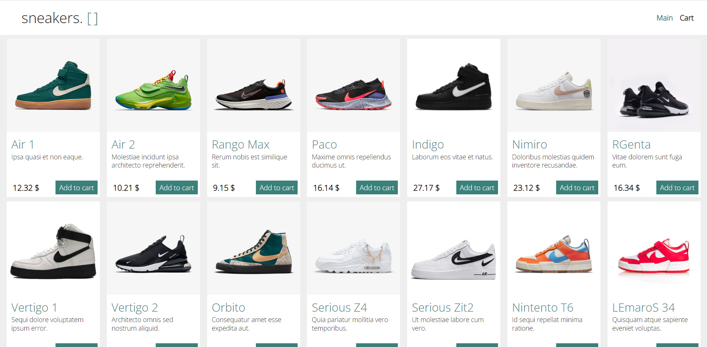
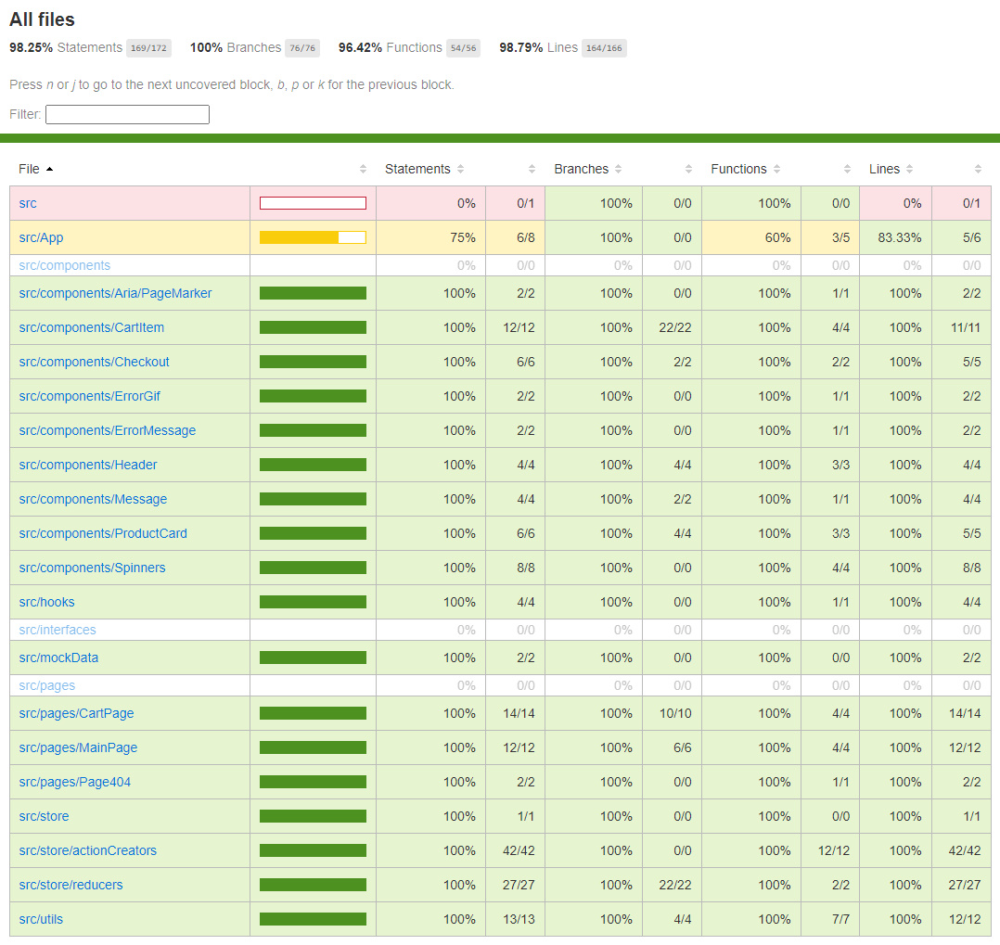
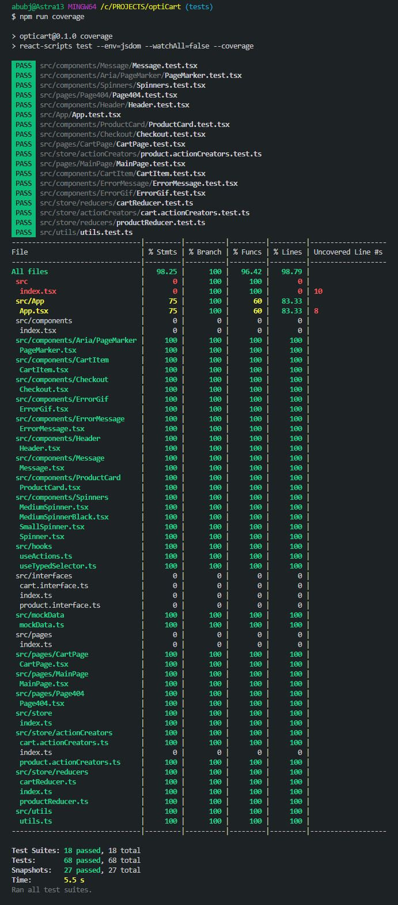
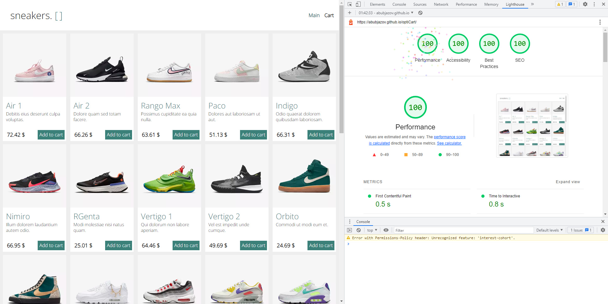
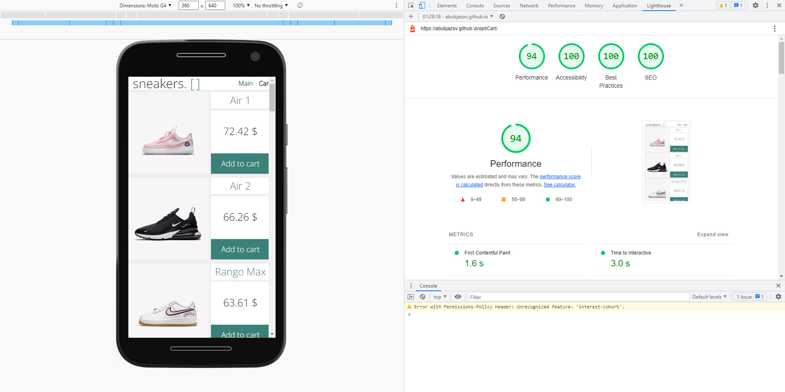
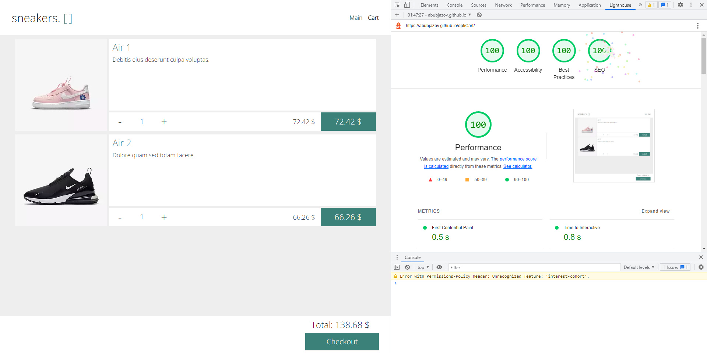
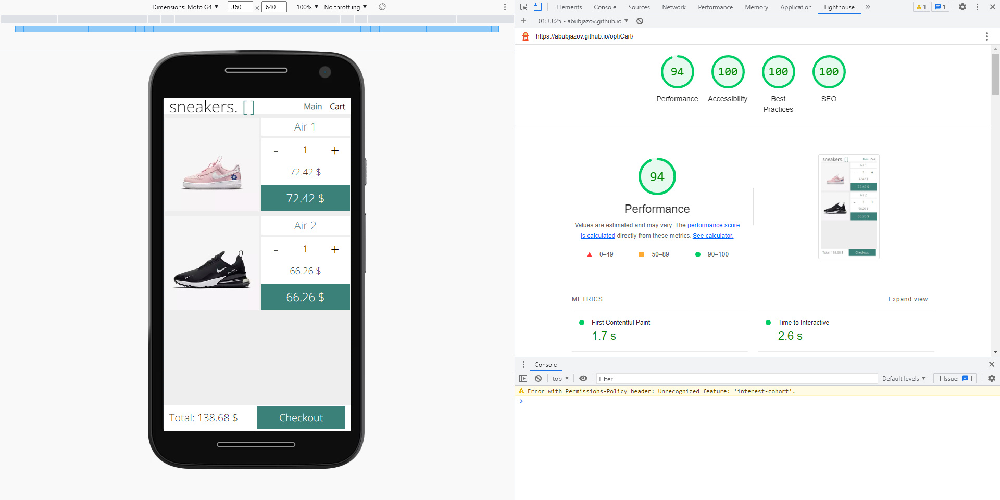
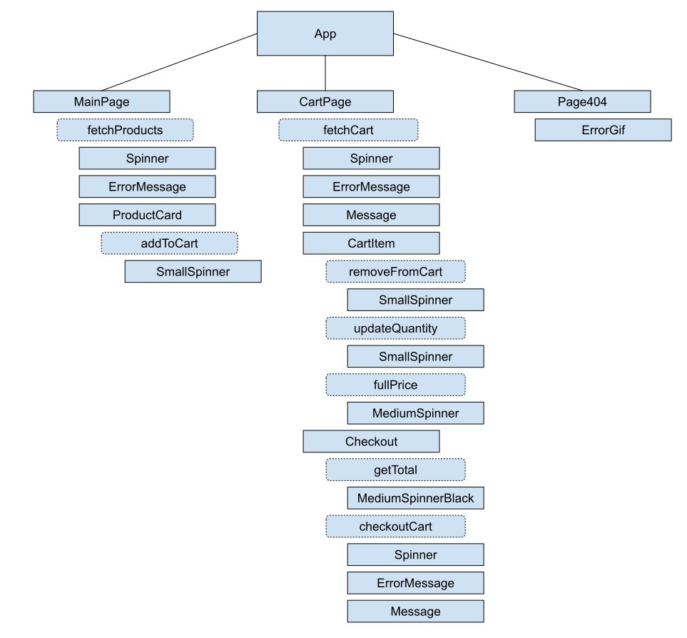

# Sneakers - Online Shopping cart.

Simple online Shopping application based on React, Redux and Typescript. :fire:

**Demo:**
Github Pages: https://abubjazov.github.io/optiCart/

**Currently application has 2 implemented sections:**

**1) Main page** - where users can add sneakers into cart.



**2) Cart page** - where users can see all `Added to cart` sneakers, review total sum and `Checkout` cart.


## :fire: Test coverage


<br>


## :white_check_mark: Lighthouse Reports

**Main page Desktop**

<br>
**Main page Mobile**

<br>
**Cart page Desktop**

<br>
**Cart page Mobile**


## Technology Stack

```
React
React Router
Redux
Redux Thunk
TypeScript
Axios
Nanoid
SASS
```

## Components Structure



## Quick Start

```
npm install
npm start
```

## Running of tests

```
npm run test
```

## Deployment

```
npm run deploy
```
