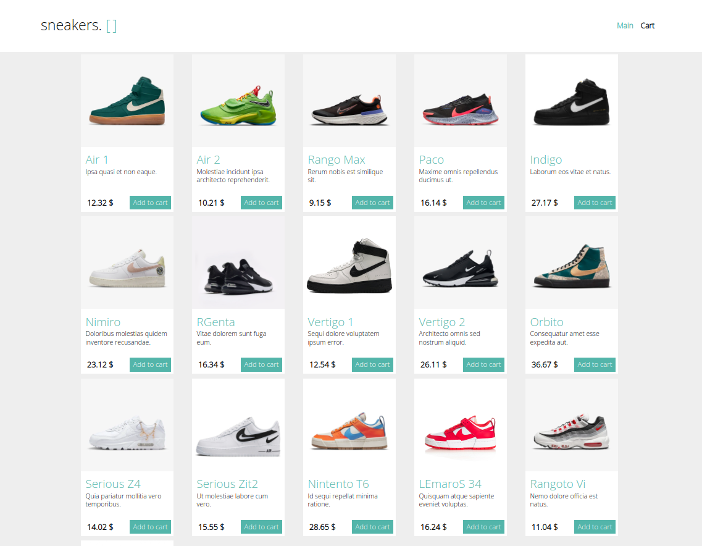
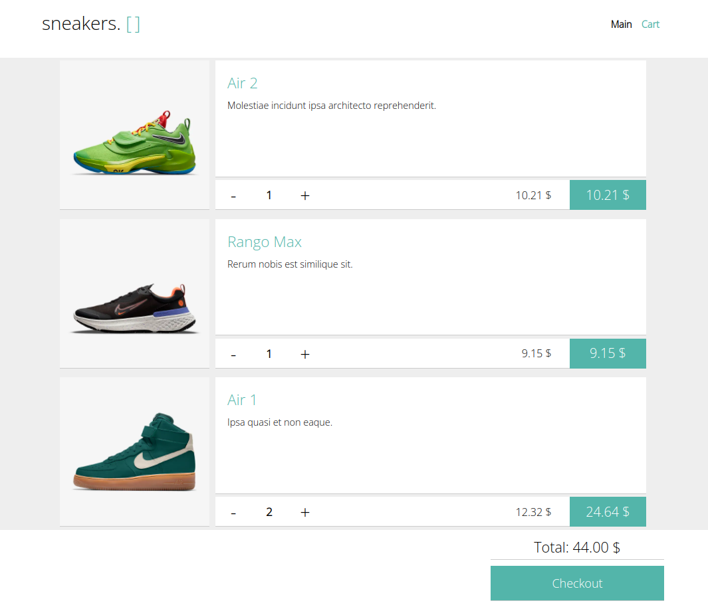

# Sneakers - Online Shopping cart.

**Demo:** https://opticart13.herokuapp.com/

Simple online Shopping application based on React, Redux and Typescript.

Currently application has 2 implemented sections:

**1) Main page** - where users can add sneakers into cart.



**2) Cart page** - where users can see all `Added to cart` sneakers, review total sum and `Checkout` cart.



## Technology Stack

```
React
React Router
Redux Thunk
TypeScript
Axios
SASS
```

## Components Structure


## Quick Start

```
npm install
npm start
```

## Running of tests

```
npm run test
```

## Deployment

```
npm run deploy
```
